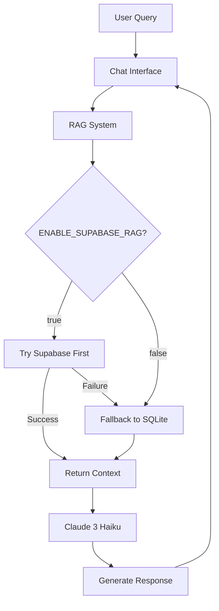
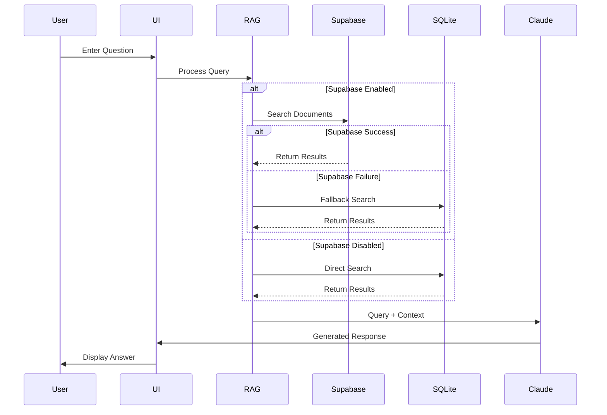

# AI Customer Support Agent with Dual-Database RAG System

This project implements an AI customer support agent using Claude 3.5 Sonnet and Claude 3.5 Haiku,, enhanced with a robust dual-database RAG (Retrieval-Augmented Generation) system. The RAG system uses Supabase (with pgvector) as the primary vector database and SQLite as a fallback, ensuring high availability and reliability.

## Features

- 🤖 Claude 3.5 Sonnet and Claude 3.5 Haiku-powered conversational AI
- 📚 Dual-database RAG system with configurable fallback
- 🔄 Toggle between Supabase and SQLite-only modes
- 🔍 Vector similarity search using OpenAI's text-embedding-3-small model
- 💾 Automatic fallback between Supabase and SQLite databases
- 📝 Support for multiple document formats (PDF, Markdown, TXT)
- 🎯 High-accuracy context retrieval for improved responses
- 🚀 Built with Next.js 15 for optimal performance

## System Architecture



## Project Structure
```
ai-customer-support-agent/
├── app/                    # Next.js app directory
│   ├── api/               # API routes
│   │   ├── chat/         # Chat endpoint
│   │   ├── generate-embedding/ # OpenAI embedding generation
│   │   └── search-sqlite/     # SQLite search endpoint
│   └── lib/              # Shared utilities
│       ├── utils.ts      # RAG and database utilities
│       └── constants.ts  # Configuration constants
├── components/           # React components
│   ├── ChatArea.tsx     # Main chat interface
│   ├── MessageList.tsx  # Chat message display
│   └── ui/              # Reusable UI components
├── docs/                # Documentation & Knowledge Base
│   ├── guides/         # User guides
│   └── faq/           # FAQ documents
├── public/             # Static assets
├── scripts/            # Utility scripts
│   ├── seed-knowledge-base.js  # Database seeding
│   └── setup-functions.sql    # Supabase setup
├── .env.local          # Environment configuration
└── knowledge.db        # SQLite database file
```

## UI Flow


## Prerequisites

- Node.js 18+ and pnpm
- Supabase account and project
- OpenAI API key
- Anthropic API key

## Environment Setup

1. Create a `.env.local` file in the project root:

```env
# API Keys
OPENAI_API_KEY=your_openai_api_key
ANTHROPIC_API_KEY=your_anthropic_api_key

# Supabase Configuration
NEXT_PUBLIC_SUPABASE_URL=your_supabase_project_url
NEXT_PUBLIC_SUPABASE_ANON_KEY=your_supabase_anon_key
SUPABASE_SERVICE_ROLE_KEY=your_supabase_service_role_key

# RAG Configuration
ENABLE_SUPABASE_RAG=true  # Set to 'false' to use SQLite only

# Optional Base URL (for production)
NEXT_PUBLIC_BASE_URL=http://localhost:3000
```

## Database Configuration

### Configuring RAG System

The system supports two modes:
1. **Dual Database Mode (Default)**
   - Set `ENABLE_SUPABASE_RAG=true`
   - Tries Supabase first, falls back to SQLite if needed
   - Provides maximum reliability

2. **SQLite Only Mode**
   - Set `ENABLE_SUPABASE_RAG=false`
   - Uses only local SQLite database
   - Useful for development or when Supabase is unavailable

### Database Locations
- **Supabase**: Cloud-hosted vector database
- **SQLite**: Local file at `./knowledge.db` in project root

## Installation and Setup

```bash
# Install dependencies
pnpm install

# Start the development server
pnpm run dev
```

## Seeding the Knowledge Base

Place your documentation files in the `docs` directory, then run:

```bash
# Seed both Supabase and SQLite databases
node scripts/seed-knowledge-base.js docs
```

The seeding script will:
1. Process all documents in the docs directory
2. Generate embeddings using OpenAI
3. Store in both Supabase and SQLite if Supabase is enabled
4. Store only in SQLite if Supabase is disabled

## Development and Testing

```bash
# Run development server
pnpm run dev

# Run tests (if available)
pnpm test

# Build for production
pnpm build
```

## Troubleshooting

1. **RAG System Issues**:
   - Check `ENABLE_SUPABASE_RAG` setting
   - Verify database connections
   - Check console logs for source used

2. **Supabase Connection Issues**:
   - Verify your Supabase credentials
   - Check if pgvector extension is enabled
   - Ensure the match_documents function exists

3. **SQLite Issues**:
   - Check if knowledge.db exists
   - Verify file permissions
   - Try reseeding the database

## Contributing

Contributions are welcome! Please read our contributing guidelines and submit pull requests to our repository.

## License

This project is licensed under the MIT License - see the LICENSE file for details.

## Support

For support, please:
1. Check the documentation
2. Search existing issues
3. Create a new issue if needed

Made with ❤️ by Gregory Kennedy - Mindful-ai-dude
