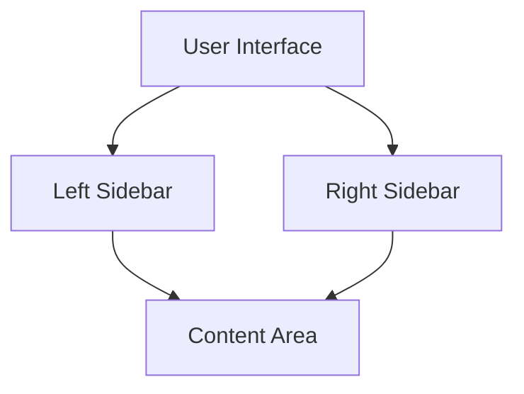
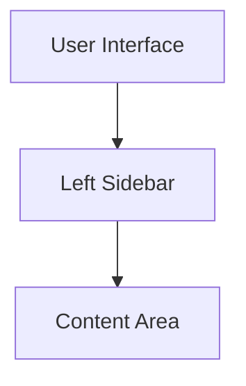
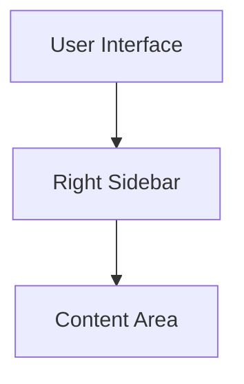
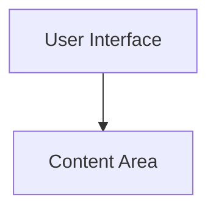

# UI Features Overview

This document outlines the various UI features available in the AI Customer Support Agent application, specifically focusing on the sidebar configurations.

## Feature Toggles

The application allows toggling the visibility of the left and right sidebars through the following scripts:

### 1. Full UI (Default)
- **Command**: `npm run dev` or `npm run build`
- **Description**: Both left and right sidebars are included.

### 2. Left Sidebar Only
- **Command**: `npm run dev:left` or `npm run build:left`
- **Description**: Only the left sidebar is included.

### 3. Right Sidebar Only
- **Command**: `npm run dev:right` or `npm run build:right`
- **Description**: Only the right sidebar is included.

### 4. No Sidebars (Chat Mode)
- **Command**: `npm run dev:chat` or `npm run build:chat`
- **Description**: Both sidebars are excluded.

## Conclusion

These feature toggles provide flexibility in the UI layout, allowing developers to customize the user experience based on their needs.
